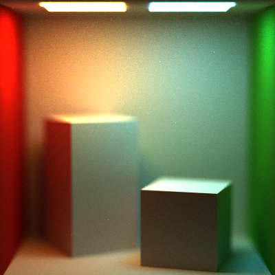
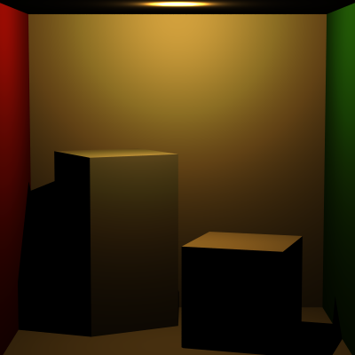
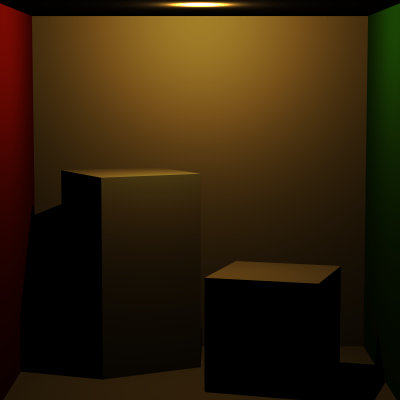
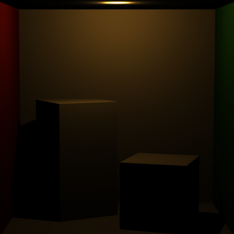
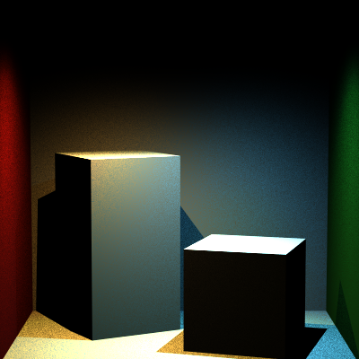
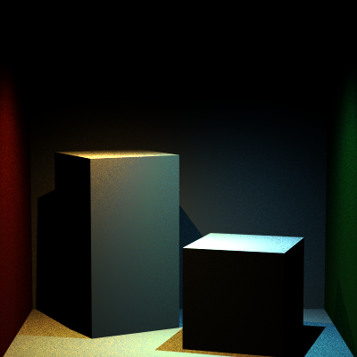
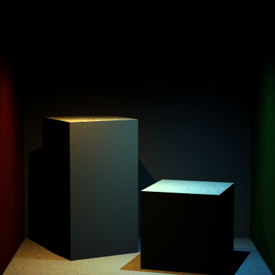
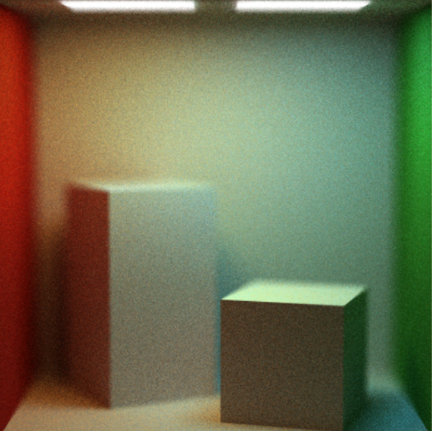
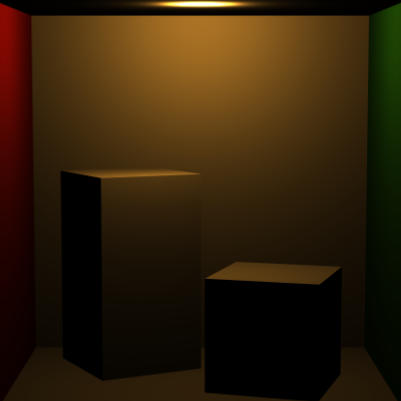
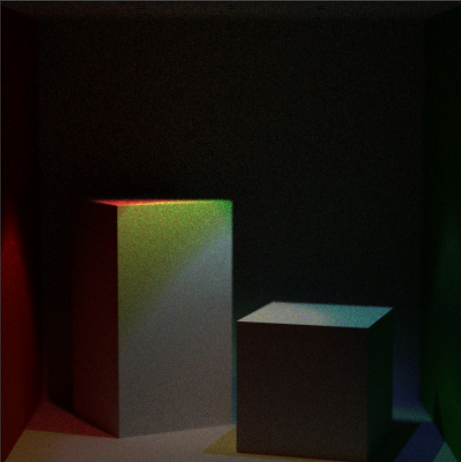

Path Tracer Part V
======================

**University of Pennsylvania, CIS 561: Advanced Computer Graphics, Homework 8**

======================
#### Name : SIREESHA PUTCHA 
#### Penn Key: sireesha 
##### My Renders: 

#### 1) ThinLens Camera 
`CS_thinLensCamera.json`

#### 2) Point Light 
`CS_pointLight.json`

#### 3) Spot Light 
`CS_spotLight.json`

 
 
 

Thin-Lens Camera (15 points)
-------------------
Implement the thin-lens camera model as described in chapter 6.2.3 of PBRT.
You may wish to make this class inherit from the base `Camera` class we have
provided. You will also have to alter the `Scene` class to include an instance
of this new camera type. Render at least one scene with this new camera in
order to exhibit its depth-of-field effect. Here is an example render of
the two-lights Cornell Box scene with a focal length of 29.5 and lens radius
of 1.5:

Constructive Solid Geometry (20 points)
--------------------
Create a data structure, e.g. a binary
tree, that can be used to combine different geometries using the three basic
CSG operations: union, difference, and intersection. You will have to write an
`Intersect` function for this data structure, and would be best served to make
it inherit from the `Primitive` class. Your data structure does not need to
handle materials or light sources; these may be properties of the `Primitives`
contained _within_ the data structure.

We will leave the demonstration of your CSG up to you, rather than providing
test renders. Make sure you showcase the three different operations.

Other light Sources (15 points)
--------------------
Implement two of the light sources described in Chapter 12 of PBRT: `PointLight`
and `SpotLight`. If you choose to implement additional light types from the ones
described, each one will be worth 10 extra credit points.

Basic Cornell Box scene with a point light rather than area light:

Two-light Cornell Box scene with spot lights rather than area lights:

